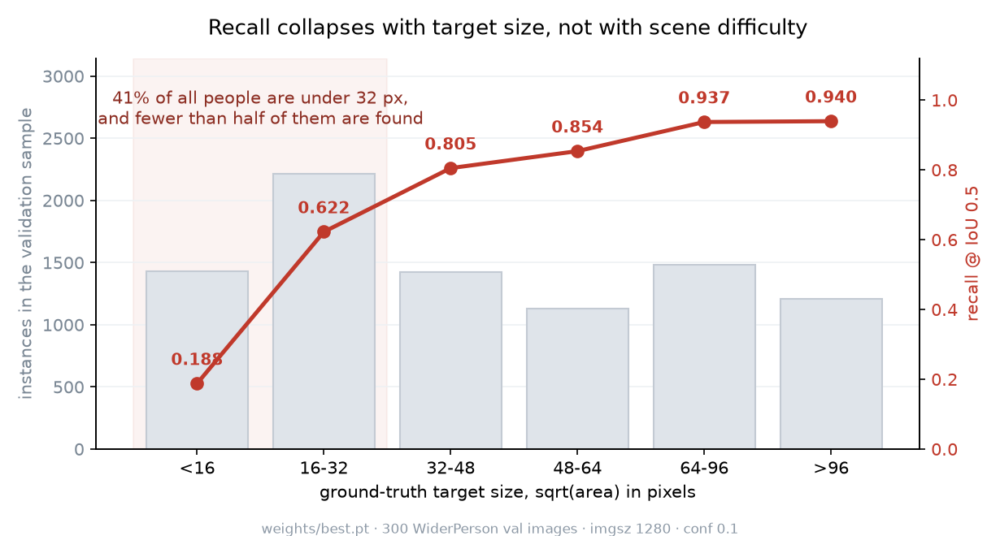
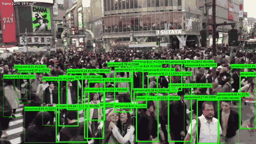
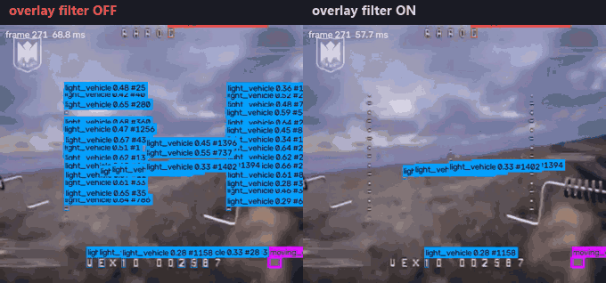
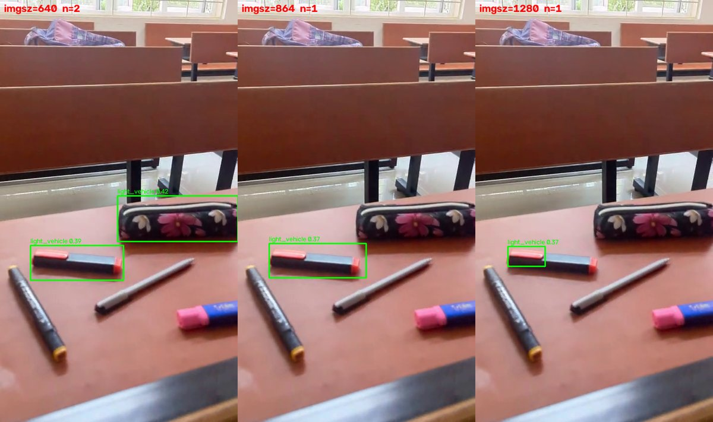

# DetecSight

Real-time person detection for video from helmet cameras and drones.

The point of this is finding people. It also detects two-wheelers and vehicles,
but those are secondary and I say below where they fall short. It's YOLO26 with
a motion filter and a HUD-overlay filter around it, served over FastAPI, running
as a TensorRT FP16 engine at about 10.5 ms a frame on my laptop GPU.

I built it for a Smart India Hackathon project and kept working on it after.

[](https://github.com/24f2006988/detecsight-sar/actions/workflows/ci.yml)
[](https://www.python.org/downloads/)
[](LICENSE)

```bash
docker build -t detecsight . && docker run -p 8000:8000 detecsight
```

CPU-only, so it's slow (709 ms a frame), but you can POST a JPEG to `/detect` at
`localhost:8000/docs` and see it work.

## Where it stands

Personnel is the class I've spent nearly all the time on.

| | |
|---|---|
| personnel mAP50 | 0.706 |
| ground-level personnel | 0.757, better than the headline number |
| people over 96 px | 0.940 recall |
| people under 16 px | **0.187** |

That last row is the whole story. Near people are basically solved. Far people
aren't, and far people aren't rare: 41% of the people in my ground-level
validation set are under 32 px and fewer than half get found.



I tried the obvious thing and it didn't work. Going from 1280 to 1536 px buys
0.4% more detections for 46% more compute, and the *large* boxes actually get
worse, because above the size it was trained at the model is off-distribution for
its own scale priors. So more pixels isn't the answer. More data might be.



*A crossing at rush hour. Median 19 tracked people a frame, peaking at 78, IDs
held through occlusion. The near field is fine. The standing crowd behind it,
several hundred people at 10-25 px, is mostly missed, exactly like the curve
says.*

## The bug I'm most pleased about

One clip gave me 54,658 vehicle boxes over 1,746 frames. There were no vehicles
in it.

I assumed it was missing training data, because the camera angle was unlike
anything in my datasets. I was about to download 100 GB of driving footage over a
metered connection.

Then I plotted where the boxes actually were. They spelled out the HUD. One box
per dash of the reticle, one per character of the telemetry string, median box
9x9 px. They were never on the scene at all.

The fix doesn't look at what's inside a box. It looks at what the box is stuck
to. A painted glyph stays put in the image while the world slides underneath it.
A real object is attached to the world, so it moves across the frame when the
camera pans. The filter watches which grid cells keep producing small detections
while the camera is known to be moving, and it gets the camera motion for free
from the motion filter that was already running.

54,658 boxes down to 6,713, and the control clip came out byte-identical.



It never masks a big box no matter how persistent, because a big persistent box
is what a real person held centred in frame looks like. And past a set fraction
of the frame it turns itself off rather than risk going blind. Both are in
`tests/test_overlay_mask.py`.

## What doesn't work yet

**People lying down, seen from a drone.** This one took me weeks. I ruled out
resolution, the infrared palette, the viewpoint and my augmentation, one at a
time. The answer was pose: no training data had anyone prone or crawling. Adding
SARD took recall from 0.143 to 0.673 and it went from finding nobody on my test
clip to finding all four.

I don't want to oversell that. It only finds them if I drop the confidence floor
to 0.10, because it scores them at 0.117-0.256. Under 16 px it still finds
nothing. And it rests on one clip and 570 test images, which isn't enough.

**Vehicles at eye level.** The vehicle classes only ever saw aerial training
data, so the model learned that a vehicle is a small thing viewed from above. On
a street with six cars in frame it reports 0.27 a frame. Stock COCO gets 5.60.
Drop my threshold to 0.02 and mine finds 6.35, boxed correctly, so it sees them
and then refuses to commit. `heavy_vehicle` scores 0.025 at ground level, which
isn't a weak class, it's a class that doesn't work. I've got BDD100K converted
and blended in as the fix but haven't run the training yet.

**Confident nonsense on things it's never seen.**



*A pencil case and a highlighter, at 0.39-0.42. More pixels removes one box and
tightens the other. It's a data gap, not a threshold to tune, and it's why the
floor sits at 0.25 instead of the 0.16 where F1 actually peaks.*

Also: ~10 fps tracked at 1280 px, no drone-as-a-target class, buses and trucks
share one class, training state is in memory and CORS is `*`.

## How I decide what ships

Not on mAP. A checkpoint has to clear `scripts/evaluate.py`: no overall
regression, no personnel regression, no class quietly collapsing to zero, and a
recall floor so a model that predicts nothing can't pass.

It's caught things. A drone-specialised checkpoint lost on its own home domain
(personnel 0.3162 against 0.7064 from the general one) and got retired.
Fine-tuning on SARD alone hit 0.870 on the target domain and destroyed
everything else, personnel 0.706 down to 0.221 with two classes gone. INT8 was
2.7 ms faster and cost 4 points of mAP50, so I dropped it. CrowdHuman, 15,000
images and most of a day, moved nothing at all.

Two things I'd tell anyone doing this. Pick thresholds on F2, not F1, because a
missed person matters more than a false box. And don't compare two checkpoints at
one fixed threshold, which I did, and what you're actually comparing is the
thresholds.

Every filter in here fails open. If it can't decide, the detection goes through.

## How it works

Four classes plus a `moving_object` tag from a separate motion channel, so
something moving coherently still gets reported when the classifier has no name
for it. `Detector.track()` runs five stages:

1. Motion detection with camera-motion compensation, so a pan doesn't read as
   the whole frame moving.
2. A test that tells a light from an object in a single frame, which also lets
   me report someone visible for only two frames.
3. The detector itself.
4. The HUD filter above.
5. Reference-image exclusion: upload a photo of something and matching
   detections get dropped, no retraining.

| endpoint | |
|---|---|
| `POST /detect` | one frame, stateless |
| `POST /detect/tracked` | a frame in a stream, with track IDs |
| `WS /ws/track/{id}` | live feed, JPEG in, JSON out |
| `POST /webrtc/offer/{id}` | live feed over WebRTC |
| `POST /train`, `GET /train/{id}` | start and watch a fine-tune |
| `POST /exclude` | upload a reference image to suppress |

Boxes come back normalised 0 to 1. Each feed keeps its own tracker and motion
history, which I had to do by hand because ultralytics reuses one tracker for
everything.

`ENGINEERING_LOG.md` has the full history, including everything I tried that
didn't work. Commands for every number above are in `docs/REPRODUCE.md`.

## Setup

```bash
pip install -e ".[serve]"
bash scripts/fetch_weights.sh v1.0.0
uvicorn app.main:app --port 8000     # not --reload, it reloads the model onto the GPU
pytest                               # 22 tests, no GPU or checkpoint needed
```

The tests check safety properties rather than happy paths: the overlay filter
never masks a big box and fails open, real motion survives and foliage jitter
doesn't, feeds keep separate state. They import nothing heavier than OpenCV so
CI runs them in seconds.

Env vars use a `BATTLESIGHT_` prefix, from what the project was called first.
Datasets aren't tracked, and the dataset configs use relative paths, so set the
root once with `yolo settings datasets_dir="<path>"`.

## Scope and provenance

This tells a person what's in frame and what's moving. They decide what it means.
It isn't targeting or classification of anyone, it finds four generic object
types and flags motion. The same thing is what search and rescue and crowd safety
need, and the hardest problem in here, finding someone lying still in vegetation
from the air, is a search and rescue problem word for word.

MIT licensed. VisDrone, WiderPerson, AerialPerson, SARD, CrowdHuman and BDD100K
are each licensed for research use by their authors.

This started as a Smart India Hackathon team project, published under our team
lead's account as [Fusion-Sight](https://github.com/soumik15630m/Fusion-Sight).
That was a team effort and that repo reflects the whole team's work. The
detection and tracking side in `app/`, `scripts/` and `tests/` is mine, and this
is that part, carried on by myself afterwards.
