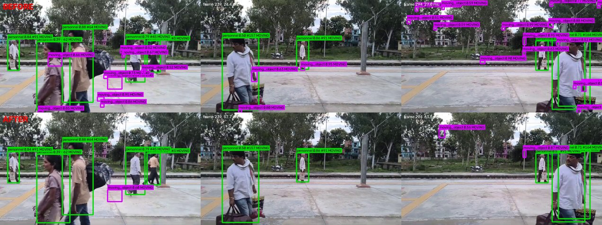

# DetecSight

Finding people and vehicles in video from drones and helmet cameras.

I started this in a Smart India Hackathon project and kept going afterwards,
because of one failure I couldn't let go of: the model couldn't find a person
lying down in vegetation, seen from a drone overhead. That's a search and rescue
problem stated almost exactly.

YOLO26 with a motion filter and a HUD-overlay filter around it, served over
FastAPI as a TensorRT FP16 engine at about 10.5 ms a frame on my laptop GPU.

[](https://github.com/24f2006988/detecsight-sar/actions/workflows/ci.yml)
[](https://www.python.org/downloads/)
[](LICENSE)


*The same eleven seconds twice. Left: 31.3 vehicles a frame on a clip with no
vehicles in it. Right: same weights, same thresholds, overlay filter on.*

```bash
docker build -t detecsight . && docker run -p 8000:8000 detecsight
```

CPU-only, about 709 ms a frame against 10.5 for the engine. A way to see it
work, not a way to run it. Swagger at `localhost:8000/docs`.

## Three things I got wrong

### The bug wasn't in the model

One clip gave me 54,658 `light_vehicle` boxes over 1,746 frames, on footage with
no vehicles in it. I assumed missing training data, because the camera angle was
unlike anything in VisDrone. I was about to pull 100 GB of driving footage over a
metered connection.

Then I plotted where the boxes were. They spelled out the HUD. One box per dash
of each reticle line, one per character of the telemetry string, median box
9x9 px. They were never on the scene.

So the fix doesn't look at what's inside a box, it looks at what the box is stuck
to. A painted glyph sits still in image space while the world slides underneath
it. A real object is attached to the world and moves across the frame when the
camera pans. The filter watches which grid cells keep producing small detections
*while the camera is independently known to be moving*, reusing the ego-motion
estimate the motion filter already computes.

Phantom boxes went 54,658 to 6,713, down 87.7%, with the control clip
byte-identical. It never masks a large box however persistent, because that's
what a real target held centred in frame looks like, and past a set fraction of
the frame it switches itself off rather than risk blinding the detector. Both
asserted in `tests/test_overlay_mask.py`.

Worth knowing: rolling-median burst detection reports zero bursts on this,
because a constant per-frame error isn't a spike.

### My validation set couldn't see the thing I was fixing

The prone-person problem came down to pose. I ruled out resolution (the people
are 50-60 px, not tiny), the false-colour infrared palette, the viewpoint and my
augmentation profile, each by direct experiment, one at a time. What was left was
that nothing in the training data had a person lying or crawling seen from above.
So I added SARD, which does.

Recall on that domain went 0.143 to 0.673. The promotion gate reported mAP50
0.6266 against a 0.6274 baseline, which is to say nothing happened.

Both numbers are right. The validation set is mostly aerial VisDrone and
structurally can't see this case, so it was answering a different question from
the one I was asking it. That's the most useful thing I got out of this project.

I also picked the wrong checkpoint twice on the way. I went with the
second-to-last epoch because it returned 71 detections where the last returned
15, which is exactly the reasoning I'd written a warning against in my own config
file. Then I walked it back on precision. Then I rendered the frames and the 71
were real people after all. The actual answer was that I'd been comparing two
differently calibrated checkpoints at one fixed threshold, which compares the
thresholds and not the models.

### The drone footage still isn't good enough

Straight about this, because the first two sections make it sound solved.

4.7x more recall on prone people is real, and on the clip I'd been staring at for
weeks it went from finding nobody to finding all four. But it only finds them
once I drop the confidence floor to 0.10, because it scores them at 0.117-0.256.
Under 16 px it finds nothing at all, 0.000 recall, and a person seen from 100 m
up is often smaller than that. One clip and 570 test images isn't enough to claim
this works, and I only have the one clip that shows the failure end to end.

Better than it was, measured, nowhere near good enough to rely on.

**And vehicles at eye level are worse.** The model detects vehicles from above;
at ground level it mostly doesn't. On street footage with about six vehicles
continuously in frame it reports 0.27 a frame. Stock COCO finds 5.60. Drop my
threshold to 0.02 and mine finds 6.35, correctly boxed, so it sees them and then
gives them almost no confidence. No threshold fixes that. I built a ground-level
val split to measure it:

| class | ground-level val | aerial val | keeps |
|---|---|---|---|
| `personnel` | 0.4554 | 0.706 | 65% |
| `two_wheeler` | 0.0581 | 0.494 | 12% |
| `light_vehicle` | 0.2821 | 0.860 | 33% |
| `heavy_vehicle` | 0.0254 | 0.449 | 6% |

`personnel` is the only class with both aerial and ground training data and the
only one that holds up. The vehicle classes have aerial only, so the model has
learned that a vehicle is a small object seen from above. BDD100K is converted
and blended in as the fix; the run isn't done, so there's no number for it.

## How a checkpoint ships

Not because its mAP went up. It has to clear a gate:

```bash
python scripts/evaluate.py runs/detect/<run>/weights/best.pt
```

Four PASS/FAIL criteria, non-zero exit on failure: no overall mAP50 regression,
no `personnel` regression, no class silently collapsed to zero, and a recall
floor to catch a model that predicts almost nothing. It also reports recall by
target size, which is what actually limits this system:


Near targets are basically solved at 0.94. All the loss is distance, and distance
isn't rare: 41% of ground-level people are under 32 px and fewer than half are
found. More pixels don't help, which surprised me. 1280 to 1536 buys 0.4% more
detections for 46% more compute, and the large buckets get *worse*, because above
the trained size the model is off-distribution for its own scale priors.


*What that curve looks like in practice. Median 19 tracked people a frame,
peaking at 78, IDs held through occlusion. The near field tracks fine; the
standing crowd behind it, several hundred people at 10-25 px, is mostly missed.*

| candidate | measured | decision |
|---|---|---|
| `battlesight_fpv` | mAP50 0.5910 to 0.6274, personnel 0.6785 to 0.7064 | promoted |
| SARD blended, 6 epochs | target recall 0.143 to 0.673, gate 0.6337 | promoted, deployed |
| VisDrone-only specialist, on its own home domain | personnel 0.3162 against 0.7064 from the general model | retired, it lost where it was specialised |
| SARD alone, 12 epochs | that domain 0.870, but blended personnel 0.706 to 0.221, two classes gone | rejected, catastrophic forgetting |
| CrowdHuman, 15,000 images | 0.6265 against 0.6274 | rejected, nothing moved |
| TensorRT INT8 | 2.7 ms faster, costs 4 mAP50 and 5 recall | rejected |
| Far-field second pass, on by default | 4-8% more people, p90 48.5 ms against 26.9 median | kept, off by default |

The rejections are the more interesting rows. Fuller list at the top of
[`ENGINEERING_LOG.md`](ENGINEERING_LOG.md), commands in
[`docs/REPRODUCE.md`](docs/REPRODUCE.md).

| | |
|---|---|
| deployed | mAP50 0.6337, recall 0.577 |
| imgsz 640 to 1280, conf 0.35 to 0.25 | VisDrone val mAP50 0.5046 to 0.5623 |
| PyTorch to TensorRT FP16 at 736x1280 | 32.28 to 10.52 ms, about 3.1x |
| personnel floor 0.20 to 0.10, on F2 not F1 | recall 0.636 to 0.725, for 5.7 points of precision |
| motion stage off the critical path | 46.4 to 24.6 ms, detection counts byte-identical |
| recall by size | under 16 px 0.187, 16-32 px 0.622, over 96 px 0.940 |

F2 rather than F1 is deliberate. F1 weights precision and recall equally and for
this they aren't: a missed person is the failure that matters, a false box is an
annoyance. Every filter here fails open. If it can't decide, the detection goes
through.

Latency on my machine varies about 3x run to run on unchanged code. I once
measured a filter as slower when disabled, which is impossible and told me the
noise was bigger than the effect. Only warmed back-to-back comparisons mean
anything.

## How it works

Four classes, `personnel`, `two_wheeler`, `light_vehicle`, `heavy_vehicle`, plus
a class-agnostic `moving_object` from a separate motion channel, so something
moving coherently still gets reported when the classifier has no name for it.

`Detector.track()` is five stages, each there because of a specific failure:

1. **Motion channel** with ego-motion compensation. A frame-to-frame affine
   transform (Shi-Tomasi + Lucas-Kanade + RANSAC) warps the previous frame into
   the current one so static structure cancels, and warps stored track histories
   too, so trajectory straightness measures the object and not the camera.
2. **Illumination vs structure.** Tells a light from an object in one frame, by
   testing whether the change is a uniform brightness shift or preserves
   structure under z-scoring. A fast path reports targets visible for two frames,
   which the four-frame coherence requirement could never report at all.
3. **Classification**, plus an optional second pass over wherever the small boxes
   already are.
4. **Overlay rejection**, the HUD filter above.
5. **Reference-image exclusion**: upload a photo and matching detections get
   dropped, via a MobileNetV3 embedding. No retraining, no new class.



*Before and after the noise gates. Purple is the motion channel, green is
classified people. The phantoms on foliage and platform edge are gone and the
classified detections carry through with identical track IDs. That's what I hold
the filter to: it may only remove what it can prove is noise.*

## API

| endpoint | |
|---|---|
| `GET /health` | model, device, class state, per-feed tracker sizes |
| `POST /detect` | one frame, stateless |
| `POST /detect/tracked` | a frame in a stream, track IDs and motion flags |
| `WS /ws/track/{source_id}` | live feed, JPEG bytes in, JSON per frame out |
| `POST /webrtc/offer/{source_id}` | live feed over WebRTC |
| `POST /train`, `GET /train/{id}` | start and monitor a fine-tuning run |
| `POST /exclude` | upload a reference image to suppress |

Boxes are normalised 0 to 1 so a client can scale to its own viewport. Worth
saying because forgetting it gives you invisible boxes and no error. Each
`source_id` keeps its own tracker, background model and motion history;
ultralytics reuses one tracker for every call, so this had to be handled
explicitly.

## Known limitations

- **Prone people from a drone are better, not solved.** 0.000 recall under 16 px,
  and the evidence is one clip and 570 test images.
- **Ground-level vehicles have collapsed.** Fix prepared, not trained.
- **~10 fps tracked** at imgsz 1280, and cost scales with what's in frame.
- **Confident false positives on things not in the training data at all:**

  

  *`light_vehicle` at 0.39-0.42 on a pencil case and a highlighter, at three
  resolutions. More pixels removes one box and tightens the other. A data gap,
  not a threshold to tune, and it's why the floor sits at 0.25 rather than the
  0.16 where mean F1 peaks.*

- **Small targets are the ceiling.** Resolution is exhausted. What's left is
  tiled inference for offline work, or a P2 head.
- No drone-as-a-target class; VisDrone is footage taken *from* drones, not of
  them. Buses and trucks share `heavy_vehicle`. Training job state is in memory
  and CORS is `*`, which is fine on a laptop and nowhere else.

## Setup

```bash
pip install -e ".[serve]"           # add gpu for TensorRT, train for augmentation
bash scripts/fetch_weights.sh v1.0.0
uvicorn app.main:app --port 8000    # not --reload, it reloads the model onto the GPU
pytest                              # 22 property tests, no GPU or checkpoint, ~0.5 s
```

The checkpoint is a [release](../../releases) asset, not a tracked file: 20 MB of
binary that changes completely on every retrain is what git stores worst.
`fetch_weights.sh` checks the sha256, because a truncated checkpoint otherwise
fails deep inside `torch.load` with a useless error.

The tests assert safety properties rather than happy paths: the overlay filter
never masks a large box and fails open, coherent motion survives and foliage
jitter doesn't, a light can be told from an object in one frame, feeds keep
separate state. The default subset imports nothing heavier than OpenCV, which is
what lets CI run it in seconds, and CI asserts that boundary on every push.
`pytest -m model` needs a checkpoint, `-m server` needs uvicorn, `-m ""` runs all.

Environment variables use a `BATTLESIGHT_` prefix, from the project's first name.
Datasets, runs and footage aren't tracked, and the dataset yamls carry no
absolute paths: they anchor at VisDrone and reach siblings with `../`, so they
resolve against whatever you set once with `yolo settings datasets_dir="<path>"`.

## Scope

This reports what's in frame and what's moving, to a person who decides what it
means. It isn't fire control, automated targeting or combatant classification.
It detects four generic object classes and flags coherent motion. The same
capability is what search and rescue, crowd safety and infrastructure inspection
need, and the hardest open problem in here, finding someone lying still in
vegetation from a drone, is a search and rescue problem almost word for word.

## Licence and provenance

MIT, see [`LICENSE`](LICENSE). VisDrone, WiderPerson, AerialPerson, SARD,
CrowdHuman and BDD100K are each licensed for research use by their authors, and
the checkpoints inherit those terms.

This started as a Smart India Hackathon team project, published under our team
lead's account as [Fusion-Sight](https://github.com/soumik15630m/Fusion-Sight).
That was a team effort and that repository reflects the whole team's work. The
detection and tracking engineering in `app/`, `scripts/` and `tests/` is mine,
and this is that part of it, continued on my own after the hackathon finished.
