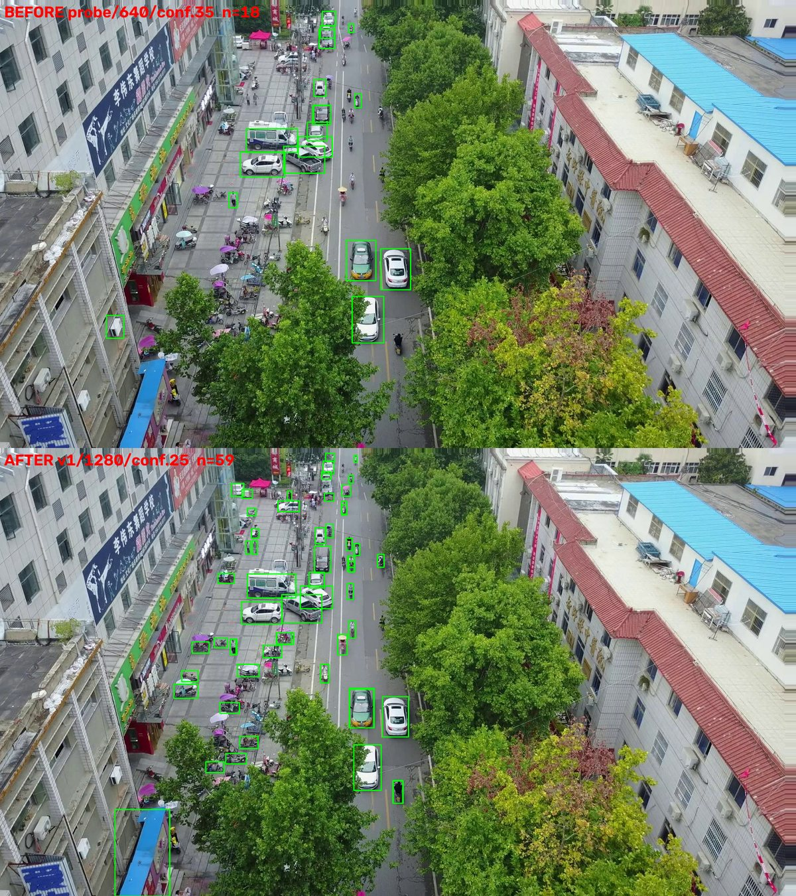

# DetecSight

Finding people and vehicles in video from drones and helmet cameras, in real
time.

I started this as part of a Smart India Hackathon project and kept working on it
afterwards, mostly because one failure case wouldn't go away: the model couldn't
find a person lying down in vegetation when the camera was a drone flying over
them. That is a search and rescue problem stated almost exactly, and it took me
about three weeks and four wrong theories to fix.

It's a YOLO26 detector with a motion filter and a HUD-overlay filter around it,
served over FastAPI, running as a TensorRT FP16 engine at about 10.5 ms per
frame on my laptop GPU.

[](https://github.com/24f2006988/detecsight-sar/actions/workflows/ci.yml)
[](https://www.python.org/downloads/)
[](LICENSE)


*The same eleven seconds of drone footage twice. On the left the model reports
31.3 vehicles per frame on a clip that contains no vehicles. On the right, the
same weights and the same thresholds with the overlay filter turned on.*

## Running it without a GPU

```bash
docker build -t detecsight .
docker run -p 8000:8000 detecsight
```

Then `http://localhost:8000/docs`, POST a JPEG to `/detect`, get boxes back.
The CPU image takes roughly 709 ms per 1280 px frame against 10.5 ms for the
FP16 engine, so it's a way to see the thing work rather than a way to run it.

## The three things I actually learned

### 1. My biggest bug wasn't in the model

One clip gave me 54,658 `light_vehicle` boxes over 1,746 frames. That's 31.3
per frame, on footage with no vehicles in it at all. I spent a while assuming
this was a training data gap, because the camera angle was unlike anything in
VisDrone, and the previous notes on the project said the same thing. I was about
to go and download 100 GB of driving footage over a metered connection.

Then I plotted where the boxes actually were. They spelled out the HUD. One box
per dash of each dotted reticle line, one per character of the telemetry string,
median box size 9x9 px. The boxes were never on the scene.

The fix doesn't look at what the boxes contain, it looks at what they're
attached to. A painted glyph sits still in image space while the world slides
underneath it. A real object is attached to the world and travels across the
frame when the camera pans. So the filter watches which grid cells keep
producing small detections *while the camera is independently known to be
moving*, reusing the ego-motion estimate the motion filter already computes, so
it costs nothing extra.

| | before | after |
|---|---|---|
| phantom `light_vehicle` | 54,658 (31.3/frame) | 6,713 (3.84/frame), down 87.7% |
| control clip | | byte-identical output |

It never masks a large box however persistent it is, because a large persistent
box is what a real target held centred in frame looks like. Past
`OVERLAY_MAX_FRACTION` it switches itself off entirely rather than risk blinding
the detector. Both properties are asserted in `tests/test_overlay_mask.py`.

One detail I'd have liked to know earlier: rolling-median burst detection
reports zero bursts on this failure, because a constant per-frame error is not
a spike. Burst counts will never find this kind of bug.

### 2. The validation set couldn't see the thing I was trying to fix

The prone-person-in-vegetation failure came down to pose, eventually. I ruled
out resolution (the people are 50 to 60 px, not tiny), the false-colour infrared
palette, the viewpoint, and my augmentation profile, each by direct experiment.
What was left was that nothing in the training mix contained a person lying or
crawling seen from above. So I added SARD, which does.

Target-domain recall went from 0.143 to 0.673. On the drone clip I'd been
staring at for weeks it went from 0 people found to all 4.

The promotion gate reported mAP50 0.6266 against a 0.6274 baseline. In other
words: nothing happened.

Both numbers are correct. The validation set is aerial-dominated and structurally
cannot see this case, so it was answering a different question from the one I was
asking it. That gap is the most useful thing I got out of this project, and it's
[section 22](ENGINEERING_LOG.md) of the log.

I also got the checkpoint choice wrong on the way through, twice. I picked the
second-to-last epoch because it returned 71 detections where the final epoch
returned 15, which is exactly the reasoning I'd written a warning against in my
own config file. Then I walked that back on precision grounds. Then I rendered
the frames and found the 71 were real people after all. The actual answer was
that I was comparing two differently calibrated checkpoints at one fixed
threshold, which compares the thresholds rather than the models. Compared at
each one's own F2 optimum the final epoch wins, and it ships.

### 3. It can't do the thing the title says

The model detects vehicles from above. At eye level it mostly doesn't.

On dense street footage with about six vehicles continuously in frame, the
deployed model reports 0.27 vehicles per frame at its deployed confidence
threshold. A stock COCO model finds 5.60. Drop my threshold to 0.02 and mine
finds 6.35, correctly boxed, in the right places. So it sees them and then
assigns them almost no confidence. That's a coverage gap, not a capacity one,
and no threshold fixes it.

I built a real-labelled ground-level validation split to measure it properly,
and the result is the clearest table in the project:

| class | ground-level val | aerial val | keeps |
|---|---|---|---|
| `personnel` | 0.4554 | 0.706 | 65% |
| `two_wheeler` | 0.0581 | 0.494 | 12% |
| `light_vehicle` | 0.2821 | 0.860 | 33% |
| `heavy_vehicle` | 0.0254 | 0.449 | 6% |

`personnel` is the only class with both aerial and ground-level training data,
and it's the only one that holds up. The three vehicle classes have aerial data
only, so the model has learned that a vehicle is a small object seen from above.
`heavy_vehicle` at 0.025 isn't a weak class, it's a class that doesn't work at
ground level at all.

The fix is prepared but not yet trained: BDD100K converted and blended in, which
is the first ground-level vehicle data the model will have seen. It's also the
first night and bad-weather data in the mix. The scripts and the val split are
in this repo; the run isn't done, so there's no number for it yet.

## How a checkpoint is allowed to ship

Nothing gets promoted because its mAP went up. It ships because it clears a
gate, and the gate is one command:

```bash
python scripts/evaluate.py                                    # what's deployed
python scripts/evaluate.py runs/detect/<run>/weights/best.pt   # a candidate
```

Four PASS/FAIL criteria with a non-zero exit on failure: no overall mAP50
regression, no `personnel` regression, no class silently collapsed to zero, and
a recall floor to catch a degenerate model that predicts almost nothing.

Alongside them it reports recall stratified by target size, which is the metric
that actually limits this system and the one overall mAP50 hides:


Near targets are basically solved at 0.94. All the loss is distance, and
distance isn't rare: 41% of the people in ground-level validation are under
32 px and fewer than half of those are found. Raising the resolution doesn't
help, which surprised me. 1280 to 1536 buys 0.4% more detections for 46% more
compute, and the *large* buckets get worse, because above the trained size the
model is off-distribution for its own scale priors. The remaining lever is data.

### What the gate has decided so far

| candidate | measured | decision |
|---|---|---|
| `battlesight_fpv` against the checkpoint before it | mAP50 0.5910 to 0.6274, personnel 0.6785 to 0.7064, recall 0.540 to 0.570, no class collapsed | promoted |
| SARD blended in, 6 epochs | target-domain recall 0.143 to 0.673, gate mAP50 0.6337 | promoted, and deployed now |
| VisDrone-only drone specialist, judged on its own home domain | overall 0.5036 to 0.6274, personnel 0.3162 to 0.7064 with the general checkpoint | retired, it lost on the domain it was specialised for |
| SARD on its own, 12 epochs | recall on that domain 0.143 to 0.870, but blended personnel mAP50 0.706 to 0.221 and two classes collapsed | rejected, catastrophic forgetting. The data was right, training on it alone was not |
| CrowdHuman, 15,000 images, 6 epochs | mAP50 0.6265 against 0.6274. Nothing moved | rejected |
| TensorRT INT8 | about 2.7 ms faster than FP16, but 4 points of mAP50 and 5 points of recall | rejected, at ~10 fps the time buys nothing visible and the recall is visible |
| Far-field second pass, on by default | 4 to 8% more people found, but p90 48.5 ms against a 26.9 ms median | kept, off by default. The jitter would make an AR overlay stutter |

The rejections are the more interesting rows, and there's a fuller list at the
top of [`ENGINEERING_LOG.md`](ENGINEERING_LOG.md).

## Results

Every number here has a command in [`docs/REPRODUCE.md`](docs/REPRODUCE.md).

| | | reproduce with |
|---|---|---|
| deployed checkpoint | mAP50 0.6337, recall 0.577 (blended val) | `scripts/evaluate.py` |
| target-domain recall, prone people from a drone | 0.143 to 0.673 | `scripts/evaluate.py` |
| inference resolution 640 to 1280, conf 0.35 to 0.25 | VisDrone val mAP50 0.5046 to 0.5623, recall 0.4855 to 0.5262 | `scripts/eval_rubric.py` |
| PyTorch FP16 to TensorRT FP16 at 736x1280 | 32.28 ms to 10.52 ms per frame, about 3.1x | `scripts/bench_imgsz.py` |
| HUD overlay filter | 54,658 to 6,713 phantom boxes, down 87.7% | `scripts/diagnose_bursts.py` |
| personnel floor 0.20 to 0.10, chosen on F2 not F1 | recall 0.636 to 0.725 for 5.7 points of precision | `scripts/eval_size_recall.py` |
| motion stage moved off the critical path | 46.4 ms to 24.6 ms median, detection counts byte-identical | `BATTLESIGHT_MOTION_PARALLEL=0/1` |
| recall by target size | under 16 px 0.187, 16 to 32 px 0.622, over 96 px 0.940 | `scripts/eval_size_recall.py` |

F2 rather than F1 is deliberate. F1 weights precision and recall equally, and
for this system they aren't equal: a missed person is the failure that matters
and a false box is an annoyance. Every gate in here is built that way, and every
one of them fails open. If a filter can't decide, the detection goes through.

The resolution fix was the first real one and the least clever. The checkpoint
had been running at imgsz 640 with a 0.35 confidence floor, both of them
inherited defaults that nobody had ever measured, including me.



*Same frame at 640/0.35 and 1280/0.25. The parked two-wheelers under the awnings
and the pedestrians on the near pavement are recovered rather than invented, you
can see them in the source frame. The false positive on the blue roof at bottom
left is the price.*

A caveat on every timing in this repo: latency on my machine varies by about 3x
run to run on unchanged code. I once measured a filter as slower when it was
disabled, which is impossible and told me the noise was bigger than the effect.
Only warmed, back-to-back, same-session comparisons are worth anything, and the
numbers above are all taken that way.

## Tracking in crowds


*A pedestrian crossing at rush hour, track IDs held through mutual occlusion.
Median 19 tracked people per frame, peaking at 78, over 2,281 unique track IDs.*

This is also where the limits show. The near field tracks well and the standing
crowd behind it, several hundred people at 10 to 25 px, is mostly missed, which
is what the size-recall curve says should happen.

## How it works

Four classes, `personnel`, `two_wheeler`, `light_vehicle` and `heavy_vehicle`,
plus a class-agnostic `moving_object` (`class_id -1`) from a separate motion
channel, so something moving coherently still gets reported when the classifier
has no name for it.

`Detector.track()` runs five stages, and each one exists because of a specific
failure rather than because it seemed like a good idea:

1. **Motion channel** (`app/motion_filter.py`). Background subtraction with
   ego-motion compensation. A frame-to-frame affine transform is fitted with
   Shi-Tomasi corners, Lucas-Kanade flow and RANSAC. The previous frame is
   warped into the current one so static structure cancels, and stored track
   histories are warped by the same transform, so trajectory straightness
   measures the object and not the camera. Four gates suppress chronic noise.
2. **Illumination vs structure.** Separates a light (a flash, a headlight,
   glare) from a real object in a single frame, by testing whether the change is
   a uniform brightness shift or preserves structure under z-scoring. There's a
   fast path for targets visible for only two frames, which the four-frame
   coherence requirement could never report at all.
3. **Classification.** Full-frame inference, plus an optional second pass that
   re-examines wherever the small boxes already are.
4. **Overlay rejection** (`app/overlay_mask.py`). The HUD filter above.
5. **Reference-image exclusion** (`app/exclusion.py`). Upload one photo of an
   object and matching detections get dropped, using a MobileNetV3 embedding and
   cosine similarity. No retraining and no new class.


*The motion channel's noise gates before and after. Purple boxes are the
class-agnostic motion channel, green are classified people. The phantom purple
boxes on the foliage and the platform edge are gone, and the classified
detections carry through untouched, with identical track IDs. That's the
property I hold the filter to: it may only remove what it can prove is noise.*

One checkpoint serves both `?view=` values now, differing only in config (the
personnel confidence floor and the motion coherence threshold). See the
retirement row in the gate table for why. Drop a `weights/drone_best.pt` back in
and `?view=drone` picks it up again, and `/health` reports `views_loaded` so a
client can tell which case it's in.

## API

| endpoint | what it does |
|---|---|
| `GET /health` | model, device and class state, per-feed tracker sizes |
| `POST /detect` | one frame, stateless |
| `POST /detect/tracked` | a frame in a stream over HTTP, track IDs and motion flags |
| `WS /ws/track/{source_id}` | live feed, send JPEG bytes and get JSON per frame |
| `POST /webrtc/offer/{source_id}` | live feed over WebRTC, detections on a data channel |
| `POST /train`, `GET /train/{id}` | start and monitor a fine-tuning run |
| `POST /exclude` | upload a reference image to suppress |

Boxes come back normalised to 0 to 1 so a client can scale them to its own
viewport without knowing the source resolution. I mention it because forgetting
it produces invisible boxes and no error.

Each `source_id` gets its own tracker, background model, motion history and
overlay mask, so state never leaks between feeds. Ultralytics hangs one tracker
off the predictor and reuses it for every call, so this had to be managed
explicitly. `tests/test_feed_isolation.py` holds it to that.

## Known limitations

These are real and I'd rather they were on the page than in a footnote.

- **Ground-level vehicle recall has collapsed.** 0.27 per frame on street
  footage plainly containing six, against mAP50 0.860 for that class on the
  aerial validation set. See section 3 above. The fix is prepared and untrained.
- **~10 fps tracked throughput** at imgsz 1280, and per-frame cost scales with
  how much is in frame, 46 ms on a crowd against 25 ms on sparse footage.
- **Confident false positives on things that aren't in the training data at
  all.** Nothing in the mix resembles an indoor close-range scene and the model
  has no learned idea of "not a vehicle" for that viewpoint:

  

  *`light_vehicle` at 0.39 to 0.42 on a pencil case and a highlighter, at three
  different resolutions. Raising the resolution removes one box and tightens the
  other, it doesn't remove the failure. This is a data gap, not a threshold to
  tune, and it's why the confidence floor sits at 0.25 rather than the 0.16
  where mean F1 actually peaks.*

- **Small targets are the ceiling.** Recall under 16 px is 0.187 on ground-level
  data and 0.000 on the drone set. Resolution is exhausted. The honest options
  left are tiled inference for offline work, or a P2 detection head.
- **No drone-as-a-target class.** VisDrone is footage taken *from* drones, not
  *of* them. That needs UAV-labelled data and a fifth class.
- Buses and trucks are both `heavy_vehicle`, which dilutes both.
- Training job state is in memory and CORS is `*`. Both are fine on a laptop and
  neither is fine anywhere else.

## Setup

```bash
pip install -e ".[serve]"           # add gpu for TensorRT, train for augmentation
bash scripts/fetch_weights.sh v1.0.0
python scripts/check_gpu.py          # should print CUDA available: True
uvicorn app.main:app --host 0.0.0.0 --port 8000
```

Don't use `--reload`. It reloads the model onto the GPU every time a file
changes.

The checkpoint is a [release](../../releases) asset rather than a tracked file,
because 20 MB of binary that changes completely on every retrain is the thing
git stores worst. `fetch_weights.sh` checks it against the published sha256,
since a truncated checkpoint otherwise fails somewhere deep inside `torch.load`
with a useless error message.

Environment variables use a `BATTLESIGHT_` prefix, from the project's original
name. Every threshold in `app/config.py` can be overridden that way and each one
has the measurement that justifies it in a comment next to it.

### Tests

```bash
pytest              # 22 property tests, no GPU and no checkpoint needed, ~0.5 s
pytest -m model     # needs a checkpoint and the torch stack
pytest -m server    # needs uvicorn running
pytest -m ""        # all of it
```

They assert safety properties rather than happy paths: that the overlay filter
never masks a large box and fails open, that coherent motion survives and
foliage jitter doesn't, that a light can be told from an object in one frame,
that track history stays bounded under eviction, and that feeds keep separate
state.

The default subset imports nothing heavier than OpenCV, no torch and no
ultralytics, which is what lets it run in CI in a couple of seconds. CI asserts
that boundary on every push rather than trusting it.

## Layout

```
app/       config, detector cascade, motion filter, overlay mask,
           exclusion store, FastAPI routers, training manager
scripts/   dataset conversion, training, TensorRT export, annotation,
           benchmarking, burst regression, the promotion gate
tests/     property tests, hardware requirements as pytest markers
data/      4-class dataset configs
docs/      figures and REPRODUCE.md
```

Datasets, training runs and captured footage aren't tracked. The dataset yamls
carry no absolute paths, they anchor at VisDrone and reach its siblings with
`../`, so they resolve against whatever you set once with
`yolo settings datasets_dir="<path>"`.

## Scope

This reports what's in frame and what's moving, to a person who decides what it
means. It is not fire control, not automated targeting and not any kind of
combatant classification. It detects four generic object classes and flags
coherent motion.

The same capability is what search and rescue, crowd safety and infrastructure
inspection need, and the hardest open problem in here, finding a person lying
still in vegetation from a drone, is a search and rescue problem almost word for
word.

## Licence and provenance

MIT, see [`LICENSE`](LICENSE). The training datasets have their own terms:
VisDrone, WiderPerson, AerialPerson, SARD, CrowdHuman and BDD100K are each
licensed for research use by their authors, and the checkpoints inherit those
terms.

This started as a Smart India Hackathon team project, which is published under
our team lead's account as
[Fusion-Sight](https://github.com/soumik15630m/Fusion-Sight). That was a team
effort and the repository reflects the whole team's work. The detection and
tracking engineering in `app/`, `scripts/` and `tests/` is mine, and this
repository is that part of it, continued on my own after the hackathon ended.
The two have diverged since; this is the one I still develop.
